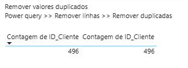
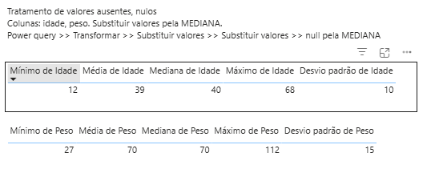
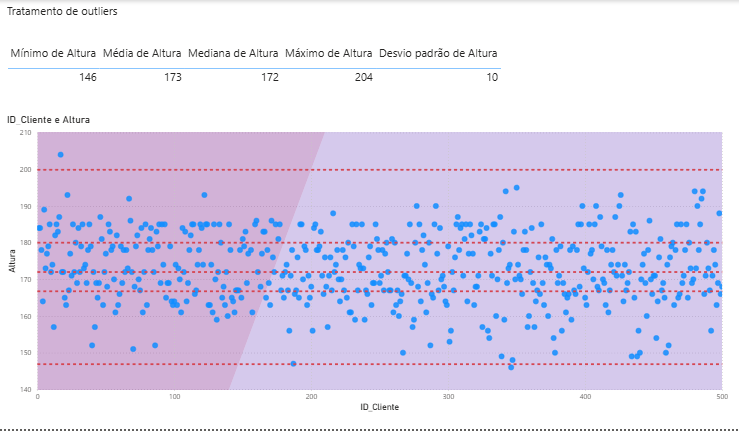

## Limpeza e Manipulação de Dados com Power BI | DSA
Curso: "Microsoft Power BI Para Business Intelligence e Data Science", por [Data Science Academy](www.datascienceacademy.com.br). 

### Remoção de valores duplicados

### Tratamento de valores ausentes/nulos

### Tratamento de valores outliers

